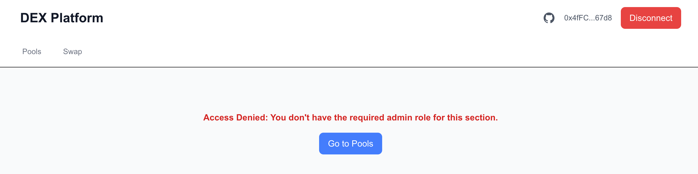
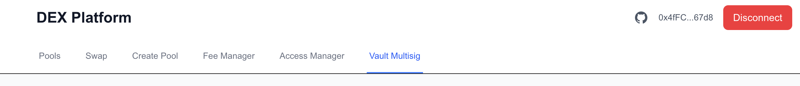
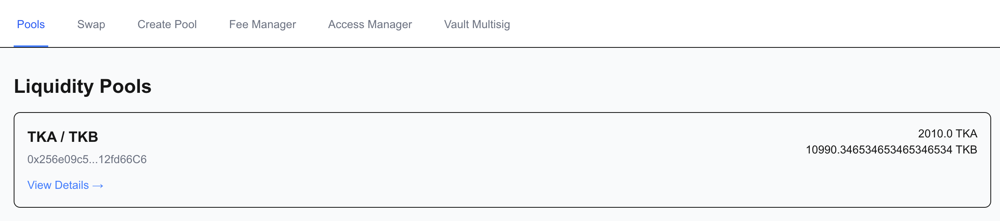
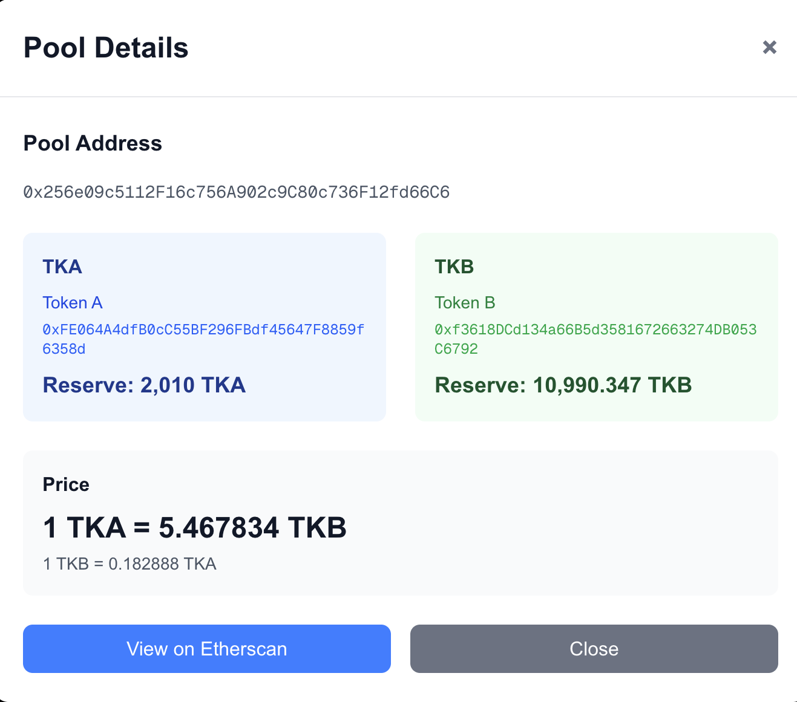
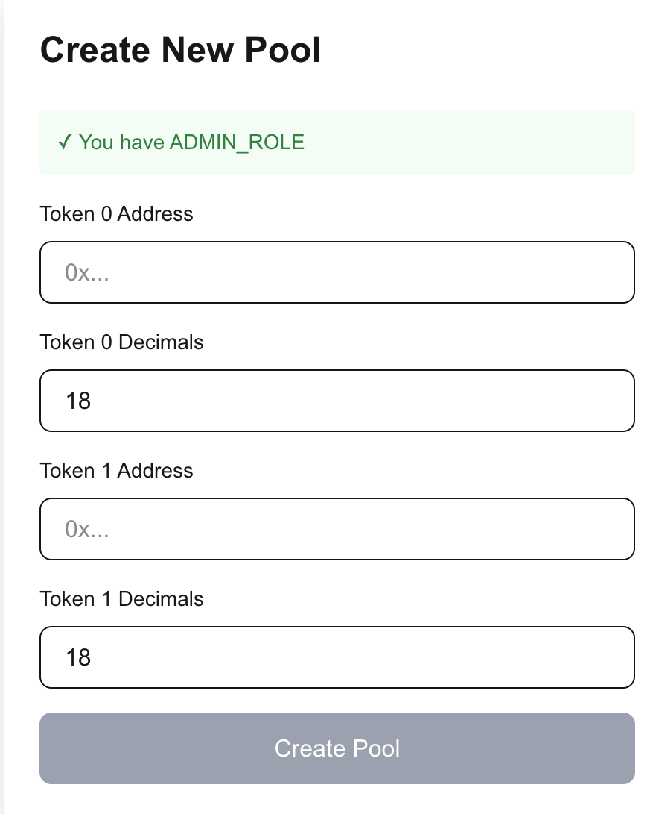
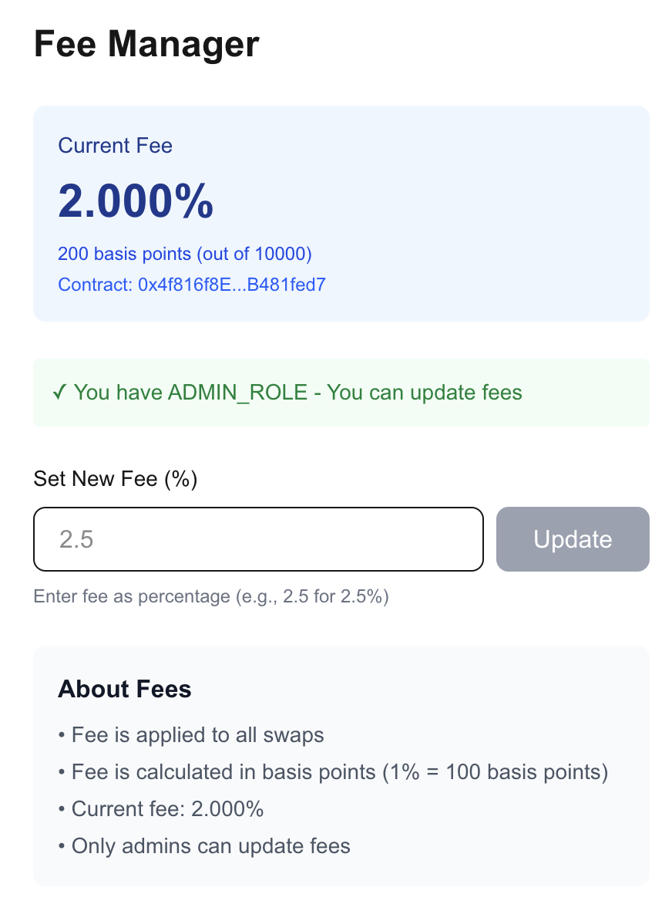
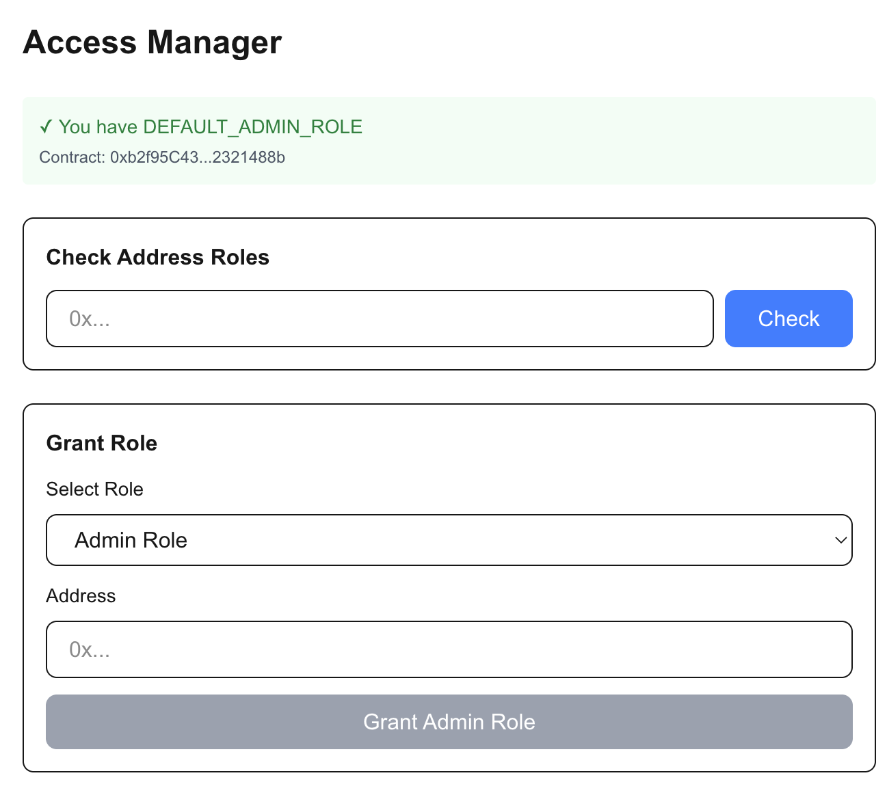
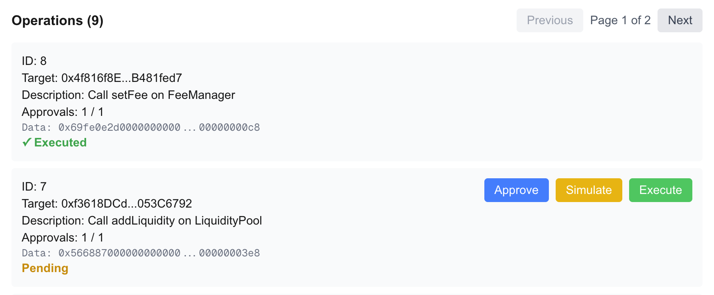
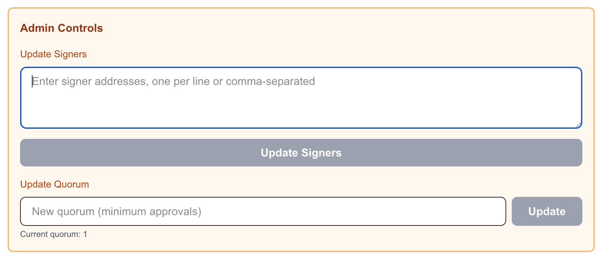

<div align="center">

# 🦄 Minimal DEX on Sepolia

**A gas-efficient decentralized exchange with modern UI, role-based access control, and multisignature wallet integration**

[](https://soliditylang.org/)
[](https://nextjs.org/)
[](https://getfoundry.sh/)
[](LICENSE)

[Features](#-features) • [Quick Start](#-quick-start) • [Contracts](#-smart-contracts) • [Architecture](#-architecture)

</div>

---

## 📋 Table of Contents

- [Overview](#-overview)
- [Screenshots](#-screenshots)
- [Features](#-features)
- [Tech Stack](#-tech-stack)
- [Quick Start](#-quick-start)
- [Smart Contracts](#-smart-contracts)
- [Architecture](#-architecture)
- [Security](#-security)
- [Deployment](#-deployment)
- [Testing](#-testing)
- [Project Structure](#-project-structure)

---

## 🎯 Overview

**Minimal DEX on Sepolia** is a decentralized exchange built on Ethereum's Sepolia testnet. It combines gas-efficient smart contract design with a modern, intuitive web interface to provide a complete DEX experience.

### What Makes It Special?

✨ **Gas-Optimized**: Factory pattern with EIP-1167 minimal proxies reduces pool deployment costs by **98%** (~45K gas vs ~2M)  
🔐 **Secure**: Role-based access control, multisignature wallet, and comprehensive input validation  
🚀 **Modern**: Built with Next.js 16, TypeScript, and Tailwind CSS for a beautiful, responsive UI  
🔧 **Flexible**: Upgradeable contracts, configurable fees, and EIP-712 signed swaps

---

## 📸 Screenshots

### User Interface

#### Non-Admin View

*Standard user interface showing only public features: Pools, Swap, and wallet connection. Admin tabs are hidden for regular users.*

#### Admin Role Interface

*Admin users see additional tabs: Add Liquidity, Create Pool, Fee Manager, Access Manager, and Vault Multisig. Role-based UI ensures only authorized users can access admin functions.*

### Core Features

#### Token Swapping

*Swap interface with pool selection, token input/output, slippage tolerance settings, and real-time price calculations. Users can swap tokens from any available liquidity pool.*

#### Pool Management

*Pool list view displaying all available liquidity pools with token pairs, reserves, and current prices. Click on any pool to view detailed information.*

#### Pool Details

*Detailed pool information modal showing token reserves, current price, and pool statistics. Users can view comprehensive pool data before making trading decisions.*

#### New Pool Creation

*Admin interface for creating new liquidity pools. Only users with DEFAULT_ADMIN_ROLE can access this feature. Factory pattern ensures gas-efficient pool deployment.*

### Admin Features

#### Fee Manager

*Fee management interface allowing admins to view and update swap fees. The FeeManager contract uses UUPS upgradeable pattern for future improvements.*

#### Access Manager

*Role management system for granting and revoking permissions. Admins can manage ADMIN_ROLE, MULTISIG_ADMIN_ROLE, and ALLOWED_EIP712_SWAP_ROLE across the platform.*

#### Vault Multisig - Overview

*Multisignature wallet dashboard showing quorum settings, current signers, pending transfers, and operations. Secure execution of critical operations requires multiple approvals.*

#### Vault Multisig - Operations

*Operation management interface for initiating, approving, and executing contract calls via multisig. Supports pool creation, fee updates, role management, and liquidity operations.*

#### Vault Multisig - Editor

*Function selector and parameter input for creating multisig operations. Admins can select from predefined functions (createPool, setFee, grantRole, etc.) or enter custom hex data.*

---

## ✨ Features

### For Users
- 🔄 **Token Swapping** - Swap tokens through liquidity pools with configurable slippage tolerance
- 📊 **Pool Discovery** - Browse all available liquidity pools with real-time reserve information
- 💰 **Price Discovery** - View current token prices and pool statistics

### For Admins
- 🏊 **Liquidity Management** - Add and remove liquidity from pools (ADMIN_ROLE required)
- 🏭 **Pool Creation** - Create new token pair pools via factory contract
- ⚙️ **Fee Configuration** - Update swap fees through upgradeable FeeManager contract
- 👥 **Role Management** - Grant and revoke roles through AccessManager

### Advanced Features
- 🔐 **Multisignature Wallet** - Secure multisig for executing critical operations
- ✍️ **EIP-712 Swaps** - Gasless swap execution via off-chain signatures
- 🎨 **Role-Based UI** - Admin tabs only visible to authorized wallets
- 📱 **Responsive Design** - Works seamlessly on desktop and mobile devices

---

## 🛠️ Tech Stack

### Smart Contracts

| Technology | Purpose |
|------------|---------|
| **Solidity** `^0.8.30` | Smart contract language |
| **Foundry** | Development, testing, and deployment framework |
| **OpenZeppelin Contracts** | Battle-tested security libraries |

**Key OpenZeppelin Components:**
- `AccessControl` - Role-based permission system
- `EIP712` - Typed structured data hashing and signing
- `Clones` - EIP-1167 minimal proxy pattern for gas efficiency
- `UUPSUpgradeable` - Upgradeable proxy pattern for FeeManager

### Frontend

| Technology | Purpose |
|------------|---------|
| **Next.js 16** | React framework with App Router |
| **TypeScript** | Type-safe development |
| **Ethers.js v6** | Ethereum blockchain interaction |
| **Tailwind CSS v4** | Utility-first styling framework |
| **React Hooks** | State management and context API |

### Development Tools

- **Foundry** - Smart contract development and testing
- **ESLint** - Code linting
- **TypeScript** - Type checking

---

## 🚀 Quick Start

### Prerequisites

Before you begin, ensure you have the following installed:

- [Node.js](https://nodejs.org/) 18+ and npm
- [Foundry](https://getfoundry.sh/) (for smart contract development)
- [MetaMask](https://metamask.io/) or compatible Web3 wallet
- Sepolia ETH for testing ([Get from faucets](https://sepoliafaucet.com))

### Installation

1. **Clone the repository**
   ```bash
   git clone https://github.com/yunoqii/dex.git
   cd dex
   ```

2. **Install Foundry dependencies**
   ```bash
   cd foundry
   forge install
   cd ..
   ```

3. **Install Node.js dependencies**
   ```bash
   npm install
   ```

### Running Locally

1. **Start the development server**
   ```bash
   npm run dev
   ```

2. **Open your browser**
   Navigate to [http://localhost:3000](http://localhost:3000)

3. **Connect your wallet**
   - Click "Connect Wallet" in the header
   - Approve the connection in MetaMask
   - **Important**: Make sure you're connected to Sepolia testnet

### Running Tests

```bash
cd foundry
forge test -vvv
```

### Building for Production

```bash
npm run build
npm start
```

---

## 📋 Smart Contracts

### Core Contracts Overview

| Contract | Purpose | Key Feature |
|----------|---------|-------------|
| **LiquidityPoolFactory** | Pool creation | Gas-efficient EIP-1167 clones |
| **LiquidityPool** | Token pair AMM | Constant product formula |
| **FeeManager** | Fee management | UUPS upgradeable |
| **EIP712Swap** | Signed swaps | Off-chain signature verification |
| **AccessManager** | Role management | Centralized permissions |
| **VaultMultisig** | Multisig wallet | Secure operation execution |

---

### 1. LiquidityPoolFactory

**Purpose**: Factory contract for creating liquidity pools using EIP-1167 minimal proxies.

#### Features
- ⛽ **Gas Efficient**: ~45K gas per pool (vs ~2M for full deployment)
- 🔒 **Duplicate Prevention**: Ensures one pool per token pair
- 📍 **Deterministic Addresses**: Optional create2 support
- 🔄 **Token Normalization**: Automatic token ordering (token0 < token1)

#### Key Functions

```solidity
function createPool(
    address token0,
    uint256 token0Decimals,
    address token1,
    uint256 token1Decimals,
    address admin
) external returns (address pool)

function createPoolDeterministic(
    address token0,
    uint256 token0Decimals,
    address token1,
    uint256 token1Decimals,
    address admin,
    bytes32 salt
) external returns (address pool)

function getPool(address token0, address token1) external view returns (address)
```

---

### 2. LiquidityPool

**Purpose**: Individual liquidity pool contract implementing constant product AMM.

#### Features
- 📊 **Constant Product AMM**: x * y = k formula
- 🔐 **Access Control**: Admin-only liquidity management
- 💰 **Configurable Fees**: Integrated with FeeManager
- ✍️ **EIP-712 Support**: Enables gasless swaps
- 📈 **Price Calculation**: Real-time price discovery

#### Key Functions

```solidity
function addLiquidity(address _token, uint256 _amount) external
function addLiquidityFrom(address _from, address _token, uint256 _amount) external
function removeLiquidity(address _token, uint256 _amount) external
function swap(
    address _sender,
    address _tokenIn,
    address _tokenOut,
    uint256 _amountIn,
    uint256 _minAmountOut
) external
function getReserves() external view returns (uint256, uint256)
function getPrice(address _tokenIn, address _tokenOut) external view returns (uint256)
```

#### Access Control
- `addLiquidity()` / `removeLiquidity()`: Requires `ADMIN_ROLE`
- `swap()`: Requires `ADMIN_ROLE` or `ALLOWED_EIP712_SWAP_ROLE`

---

### 3. FeeManager

**Purpose**: Upgradeable contract managing swap fees across all pools.

#### Features
- 🔄 **UUPS Upgradeable**: Can be upgraded by DEFAULT_ADMIN_ROLE
- 💵 **Basis Points**: Fee in basis points (e.g., 250 = 2.5%)
- 📊 **Dynamic Calculation**: Calculates fees based on swap output
- 🔐 **Admin Controlled**: Only DEFAULT_ADMIN_ROLE can update fees

#### Key Functions

```solidity
function setFee(uint256 _fee) external  // DEFAULT_ADMIN_ROLE required
function getFee(ISwap.SwapParams memory swapParams) external view returns (uint256)
function _authorizeUpgrade(address newImplementation) internal  // DEFAULT_ADMIN_ROLE required
```

---

### 4. EIP712Swap

**Purpose**: Enables gasless swap execution via EIP-712 typed structured data signatures.

#### Features
- ✍️ **Off-Chain Signing**: Users sign swap requests off-chain
- 🔢 **Nonce Management**: Prevents replay attacks
- ⏰ **Deadline Enforcement**: Time-bound swap requests
- ✅ **Signature Verification**: ECDSA signature validation

#### Key Functions

```solidity
function executeSwap(
    ISwap.SwapRequest memory _swapRequest,
    bytes memory _signature
) public returns (bool)

function verify(
    ISwap.SwapRequest memory _swapRequest,
    bytes memory _signature
) public view returns (bool)

function getNonce(address _sender) public view returns (uint256)
```

#### Swap Request Structure
```solidity
struct SwapRequest {
    address pool;
    address sender;
    address tokenIn;
    address tokenOut;
    uint256 amountIn;
    uint256 minAmountOut;
    uint256 nonce;
    uint256 deadline;
}
```

---

### 5. AccessManager

**Purpose**: Centralized role management system for the entire DEX.

#### Features
- 👥 **Multi-Role System**: Four distinct role types
- 🔐 **Hierarchical Permissions**: DEFAULT_ADMIN_ROLE controls all
- ✅ **Role Checking**: View functions for role verification
- 🔄 **Dynamic Management**: Grant/revoke roles on the fly

#### Role Types

| Role | Purpose | Managed By |
|------|---------|------------|
| `DEFAULT_ADMIN_ROLE` | Full system control | Deployer only |
| `ADMIN_ROLE` | Pool liquidity management | DEFAULT_ADMIN_ROLE |
| `MULTISIG_ADMIN_ROLE` | Multisig wallet management | DEFAULT_ADMIN_ROLE |
| `ALLOWED_EIP712_SWAP_ROLE` | EIP-712 swap execution | DEFAULT_ADMIN_ROLE |

#### Key Functions

```solidity
// Admin management
function addAdmin(address _admin) external
function removeAdmin(address _admin) external

// Multisig admin management
function addMultisigAdmin(address _multisigAdmin) external
function removeMultisigAdmin(address _multisigAdmin) external

// EIP712 swapper management
function addEIP712Swapper(address _swapper) external
function removeEIP712Swapper(address _swapper) external

// Role checking
function isAdmin(address _address) external view returns (bool)
function isMultisigAdmin(address _address) external view returns (bool)
function isEIP712Swapper(address _address) external view returns (bool)
```

---

### 6. VaultMultisig

**Purpose**: Multisignature wallet for secure execution of critical operations.

#### Features
- 👥 **Configurable Quorum**: Minimum approvals required
- 💸 **ETH Transfers**: Secure ETH transfer execution
- 🔧 **Contract Operations**: Execute arbitrary contract calls
- ✅ **Approval Workflow**: Multi-step approval process
- 🔐 **Signer Management**: Add/remove signers (MULTISIG_ADMIN_ROLE)

#### Operation Flow

1. **Initiate**: A signer creates a transfer or operation proposal
2. **Approve**: Other signers approve the proposal
3. **Execute**: Once quorum is reached, any signer can execute

#### Key Functions

```solidity
// Transfers
function initiateTransfer(address _to, uint256 _amount) external
function approveTransfer(uint256 _transferId) external
function executeTransfer(uint256 _transferId) external

// Operations
function initiateOperation(
    address _target,
    bytes memory _data,
    string memory _description
) public
function approveOperation(uint256 _operationId) external
function executeOperation(uint256 _operationId) external

// Management (MULTISIG_ADMIN_ROLE required)
function updateSigners(address[] memory _signers) external
function updateQuorum(uint256 _quorum) external
```

#### Supported Operations
- Pool creation via Factory
- Fee updates on FeeManager
- Role management on AccessManager
- Liquidity management on pools
- Any arbitrary contract call

---

## 🏗️ Architecture

### Contract Relationships

```
                    ┌─────────────────────┐
                    │   AccessManager     │
                    │  (Role Hub)         │
                    └──────────┬──────────┘
                               │
                ┌──────────────┼──────────────┐
                │              │              │
        ┌───────▼──────┐  ┌───▼──────────┐  │
        │   Factory    │  │ VaultMultisig │  │
        │  (Pool       │  │  (Multisig)    │  │
        │  Creation)   │  └───────────────┘  │
        └───────┬──────┘                     │
                │                            │
        ┌───────▼────────┐                    │
        │ LiquidityPool │                    │
        │   (AMM)       │                    │
        └───────┬───────┘                    │
                │                            │
    ┌───────────┼───────────┐                │
    │           │           │                │
┌───▼────┐ ┌───▼────────┐  │                │
│ Fee    │ │ EIP712Swap │  │                │
│Manager │ │ (Signing)  │  │                │
└────────┘ └────────────┘  └────────────────┘
```

### Data Flow

#### Swap Flow
```
User → Approve Token → Swap Function → FeeManager (calculate fee) → Transfer Tokens → Update Reserves
```

#### Pool Creation Flow
```
Admin → Factory.createPool() → Clone Implementation → Initialize Pool → Grant Roles → Store Pool Address
```

#### Multisig Operation Flow
```
Signer → Initiate Operation → Other Signers Approve → Quorum Reached → Execute Operation → Target Contract
```

---

## 🔐 Security Features

### Access Control
- ✅ **Role-Based Permissions**: Granular access control for all sensitive functions
- ✅ **Hierarchical Roles**: DEFAULT_ADMIN_ROLE controls all other roles
- ✅ **Contract-Level Roles**: Each pool has its own ADMIN_ROLE

### Multisignature Protection
- ✅ **Quorum Requirement**: Operations require multiple approvals
- ✅ **Configurable Threshold**: Adjustable quorum based on signer count
- ✅ **Operation Simulation**: Pre-execution simulation to catch errors

### Contract Security
- ✅ **Input Validation**: Comprehensive checks for addresses, amounts, and states
- ✅ **Reentrancy Protection**: Safe external calls
- ✅ **Upgradeable Pattern**: Controlled upgrades via UUPS
- ✅ **Error Handling**: Custom errors for better debugging

### Gas Optimization
- ✅ **Minimal Proxies**: EIP-1167 pattern reduces deployment costs by 98%
- ✅ **Efficient Storage**: Optimized state variable layout
- ✅ **Batch Operations**: Support for multiple operations in single transaction

---

## 📝 Deployment

### Prerequisites

1. **Environment Setup**
   ```bash
   cd foundry
   cp .env.example .env
   ```

2. **Required Environment Variables**
   ```bash
   PRIVATE_KEY=your_private_key_here
   SEPOLIA_RPC_URL=https://sepolia.infura.io/v3/YOUR_KEY
   ETHERSCAN_API_KEY=your_etherscan_key
   ```

### Deploy All Contracts

```bash
cd foundry
forge script script/DeployAll.s.sol:DeployAll \
  --rpc-url $SEPOLIA_RPC_URL \
  --broadcast \
  --verify \
  -vvvv
```

### Individual Contract Deployment

```bash
# Deploy AccessManager
forge script script/DeployAccessManager.s.sol --rpc-url $SEPOLIA_RPC_URL --broadcast

# Deploy FeeManager
forge script script/DeployFeeManager.s.sol --rpc-url $SEPOLIA_RPC_URL --broadcast

# Deploy EIP712Swap
forge script script/DeployEIP712Swap.s.sol --rpc-url $SEPOLIA_RPC_URL --broadcast

# Deploy Factory
forge script script/DeployLiquidityPoolFactory.s.sol --rpc-url $SEPOLIA_RPC_URL --broadcast

# Deploy VaultMultisig
forge script script/DeployVaultMultisig.s.sol --rpc-url $SEPOLIA_RPC_URL --broadcast
```

### Update Frontend Configuration

After deployment, update `app/config.ts` with your deployed contract addresses:

```typescript
export const CONTRACTS = {
    FACTORY: "0x...",
    FEE_MANAGER: "0x...",
    EIP712_SWAP: "0x...",
    ACCESS_MANAGER: "0x...",
    VAULT_MULTISIG: "0x...",
} as const;
```

---

## 🧪 Testing

### Run All Tests

```bash
cd foundry
forge test -vvv
```

### Run Specific Test File

```bash
forge test --match-path test/LiquidityPool.t.sol -vvv
```

### Test Coverage

The test suite covers:

- ✅ **Access Control**: Role granting, revoking, and checking
- ✅ **Pool Creation**: Factory deployment and pool initialization
- ✅ **Liquidity Management**: Adding and removing liquidity
- ✅ **Swap Functionality**: Token swaps with fee calculation
- ✅ **EIP-712 Swaps**: Signature verification and execution
- ✅ **Multisig Operations**: Transfer and operation workflows
- ✅ **Error Handling**: Custom error scenarios
- ✅ **Edge Cases**: Boundary conditions and invalid inputs

### Test Files

- `AccessManager.t.sol` - Role management tests
- `LiquidityPool.t.sol` - AMM functionality tests
- `LiquidityPoolFactory.t.sol` - Factory and clone tests
- `EIP712Swap.t.sol` - Signature verification tests
- `FeeManager.t.sol` - Fee calculation and upgrade tests
- `VaultMultisig.t.sol` - Multisig operation tests

---

## 📚 Project Structure

```
dex/
├── app/                          # Next.js frontend application
│   ├── components/              # React components
│   │   ├── AccessManager.tsx    # Role management UI
│   │   ├── AddLiquidity.tsx     # Add liquidity interface
│   │   ├── CreatePool.tsx       # Pool creation UI
│   │   ├── FeeManager.tsx       # Fee management UI
│   │   ├── PoolDetails.tsx      # Pool information modal
│   │   ├── PoolList.tsx         # Pool listing
│   │   ├── PoolSelector.tsx     # Pool selection component
│   │   ├── Swap.tsx             # Token swap interface
│   │   ├── VaultMultisig.tsx    # Multisig wallet UI
│   │   ├── WalletButton.tsx     # Wallet connection
│   │   └── Toast.tsx             # Notification component
│   ├── contexts/                # React contexts
│   │   └── ToastContext.tsx     # Toast notification context
│   ├── config.ts                # Contract addresses & ABIs
│   ├── page.tsx                 # Main application page
│   └── layout.tsx               # Root layout
│
├── foundry/                      # Smart contract development
│   ├── src/                     # Contract source files
│   │   ├── AccessManager.sol    # Role management contract
│   │   ├── EIP712Swap.sol       # EIP-712 swap contract
│   │   ├── FeeManager.sol       # Fee management contract
│   │   ├── LiquidityPool.sol    # AMM pool contract
│   │   ├── LiquidityPoolFactory.sol  # Pool factory
│   │   ├── VaultMultisig.sol    # Multisig wallet
│   │   ├── Roles.sol            # Role definitions
│   │   └── ISwap.sol            # Swap interface
│   ├── test/                    # Test files
│   │   ├── AccessManager.t.sol
│   │   ├── EIP712Swap.t.sol
│   │   ├── FeeManager.t.sol
│   │   ├── LiquidityPool.t.sol
│   │   ├── LiquidityPoolFactory.t.sol
│   │   └── VaultMultisig.t.sol
│   ├── script/                  # Deployment scripts
│   │   ├── DeployAll.s.sol      # Master deployment script
│   │   ├── DeployAccessManager.s.sol
│   │   ├── DeployFeeManager.s.sol
│   │   ├── DeployEIP712Swap.s.sol
│   │   ├── DeployLiquidityPoolFactory.s.sol
│   │   ├── DeployVaultMultisig.s.sol
│   │   └── DeployERC20Tokens.s.sol
│   └── foundry.toml             # Foundry configuration
│
├── package.json                  # Node.js dependencies
├── tsconfig.json                # TypeScript configuration
├── next.config.ts              # Next.js configuration
└── README.md                    # This file
```

---

## 👤 Author

**yunoqii**

- GitHub: [@yunoqii](https://github.com/yunoqii)
- Project: [https://github.com/yunoqii/dex](https://github.com/yunoqii/dex)

---

<div align="center">

**Built with ❤️ for the Ethereum ecosystem**

*[a minimal dex on Sepolia by yunoqii](https://github.com/yunoqii/dex)*

</div>
